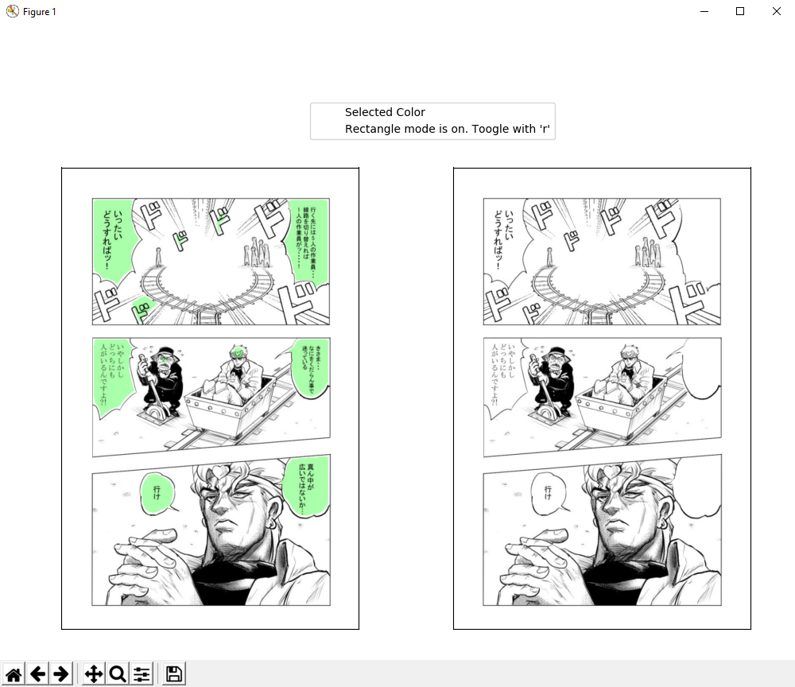

# A Manga Text Cleaner

## Introduction

This application aims to facilitate the cleaning of manga/BD/comic speech bubble. It use a basic U-Net model pre-segment the bubbles, then ask the user to choose the area to remove. Unfortunately, it is not yet possible to let the model run by itself on multiple images, the foremost limitation being the size of the dataset used to train the model. However, I'm certain that some could find this application useful.

## How To Use

The run the app, you can use the default command :
```
python MangaTextCleaner.py
``` 
The app will be launched with the defaults parameters. These parameters are:
- `path` : use it to specify the path to your files. The default value is `./to_clean/*.jpg`.
- `output_folder` : use it to change the output folder. The default value is `./cleaned`

The application recognizes six kind of actions :
- The **left click** adds points to the annotater. By default, it draw rectangles (see below). This way, only two clicks are needed to draw a polygon.    
- The **right click** removes points. If no points are drawn, it will remove the last polygon. If neither polygons nor points are added, it will go to the previous picture. 
- The **center click** copies a color on the input image. This color will be used to fill the removed areas. By default, the selected color is white, but this action is useful if the cell to clean is black.   
- The **0 key** of the numpad is used to validate a polygon. After validation, the content of the segmented region will be erased on the left panel. Then you can proceed to add more polygons. 
- The **Enter key** validates the picture and go the next one. At this moment, the output is generated and all recorded polygons are discarded, so it is to be used with caution.     
- The **'r' key** toogle the rectangle mode. In this mode, the second click put three points at the same time to form a rectangle.


## Example

First, I need to thank Fikkyun and Chamaji as I will use their work to illustrate this application. Original files are [here](https://66.media.tumblr.com/f60a943f7539f80e7da525d6d51b0afd/tumblr_o9ne172Pnc1tdtuaeo1_1280.jpg) and [here](https://twitter.com/i/web/status/1117227652216057856).

So, when you run the command, a matplotlib window will open. The application is really minimalistic and this window will be its only frame. As you can see, two panels appear. The first one is the image plus the segmentation mask (with suspected text area in green). The second is the current result. As you annotate, the text will disappear.


As you can see over the images, the selected color is white. However, as the text areas are black, you need to select the according color. This can be done by clicking, with the central button, on a region of the picture with the right image. After clicking, you should see the color change:


Then you can draw your polygons. As the *rectangle mode* is on, you only need to left-click two times to draw a polygon.


By hitting the *0 key*, the polygon is validated. The pixels that are both in the polygon and the segmentation mask will be replaced by the selected color.


If the segmentation mask is already satisfying, you can used a single polygon to remove the content of multiple bubble at the same time.




When the page has been cleaned, press *Enter* to go to the next image. 

Some combinations of action are impossible. Hopefully they will all be caught and explicitly returned, with an explanation on what happened.

## Requirements

Obviously, python3 is required to run the .py. More specifically, the program was checked to work with :
- Python 3.6.9
- fire==0.2.1
- Keras==2.2.4
- matplotlib==3.1.1
- numpy==1.19.3
- PIL==1.1.7
- scikit-image==0.16.2
- tensorflow-gpu==1.14.0
